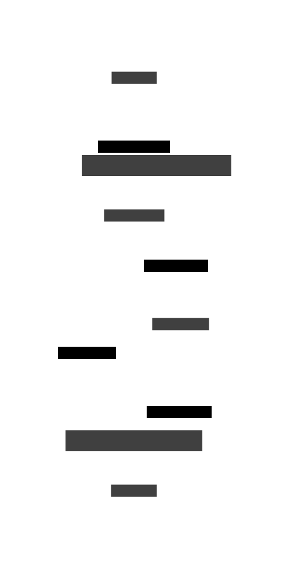

Turns this

```
;Function definitions with metadata

(defn verify-account
  {:receives #{:account-requested}
   :returns #{:account-verified
              :account-failed}}
  [ctx event])

(defn open-account
  {:receives #{:account-verified}
   :returns #{:account-opened}}
  [ctx event])

(defn send-email
  {:receives #{:account-failed :account-opened}}
  [ctx event])

;Whole system definition

(def system
  [{:event :account-requested
    :in [:commands]
    :out {:account-verified :new-accounts
          :account-failed :notifications}
    :targets {:any [#'verify-account]}}

   {:event :account-verified
    :in [:new-accounts]
    :out {:account-opened :new-accounts}
    :targets {:any [#'open-account]}}

   {:event :account-failed
    :in [:notifications]
    :targets {:any [#'send-email]}}

   {:event :account-opened
    :in [:new-accounts]
    :targets {:any [#'send-email]}}])


;Deployment definitions

(def accounts-deployment
  [#'verify-account
   #'open-account])

(def notifier-deployment
  [#'send-email])
```

Into this


